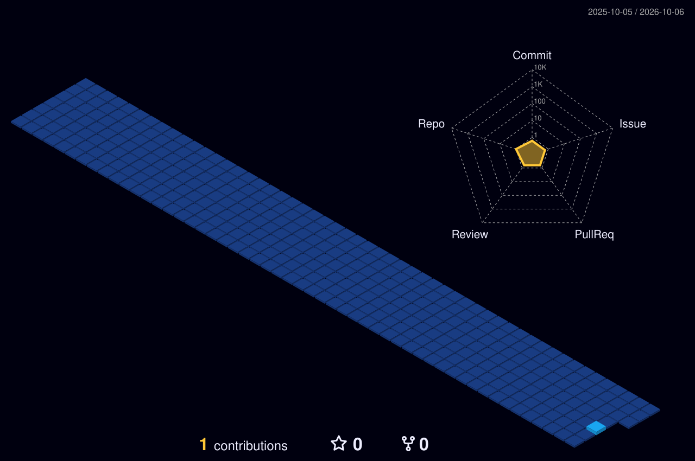

<!-- 🎬 HERO — video intro + name -->

  

<!-- 👨‍💻 LEFT: what I build   •   🏃 RIGHT: life outside code -->

  

<!-- ⚛️ TECH STACK -->

  

<!-- 🪪 DEVELOPER ID + DASHBOARD -->

  

<!-- 📊 GITHUB STATS & TOP LANGUAGES -->

  
  

<!-- 🏆 DEVELOPER TROPHIES -->

  

## 🎌 Featured builds

| Project | What it is | Stack | Stars |
|:---|:---|:---|:---:|
| [**FounderAI — Multi-Agent Startup Builder**](https://github.com/U-Uttam/FounderAI) | 11-agent LangGraph platform for autonomous startup planning from business ideas | `LangGraph` `FastAPI` `React` `Gemini API` | ⭐ |
| [**Smart Email Prioritization System**](https://github.com/U-Uttam/Smart-Email-Prioritization) | Real-time ETL pipeline using Kafka and Spark Structured Streaming | `Kafka` `Spark` `Gmail API` | ⭐ |
| [**AI Automotive Voice Assistant + AR/VR**](https://github.com/U-Uttam/AI-Voice-Assistant-ARVR) | Automotive voice assistant with AR/VR vehicle visualization | `FastAPI` `REST APIs` `AR/VR` | ⭐ |
| [**IoT Smart Energy Meter**](https://github.com/U-Uttam/IoT-Smart-Energy-Meter) | Cloud-connected IoT monitoring solution for energy usage tracking | `IoT` `Cloud Computing` | ⭐ |
| [**QR Identity Verification System**](https://github.com/U-Uttam/QR-Identity-Verification) | QR authentication platform with database-driven validation | `APIs` `Database Management` | ⭐ |
| [**CampusConnect — AI Clubs Portal**](https://github.com/U-Uttam/CampusConnect) | Centralized student activity portal with chatbot assistance | `JavaScript` `MySQL` | ⭐ |

 

## 🌃 My contribution city

*Every commit builds another tower — rebuilt automatically every day.*

  

<!-- 💌 LET'S CONNECT -->

  

 

**Always learning, always building.** ⚡

